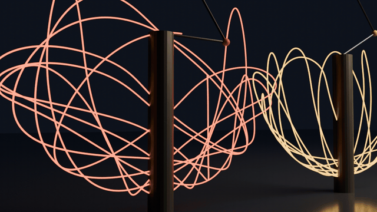

# 🦋 kaos-atolyesi — Blender

**EN:** A dark hall of double-pendulum machines. Each pendulum's tip has spent 16 seconds signing its name in glowing neon — the trail is the machine's *real* trajectory, integrated with RK4, never authored. The last machine is the story: two pendulums started **10⁻⁹ radians apart**. For two seconds their trails are one; then determinism keeps its promise and they separate forever.

**TR:** Karanlık bir salonda çift sarkaç makineleri. Her sarkacın ucu 16 saniye boyunca parlayan neonla imzasını atmış — iz, makinenin *gerçek* yörüngesidir: RK4 ile entegre edilir, elle çizilmez. Son makine hikâyenin kendisi: **10⁻⁹ radyan farklı** başlatılan iki sarkaç. İki saniye izleri tektir; sonra determinizm sözünü tutar ve sonsuza dek ayrılırlar.



*Camera dollies past five signatures and stops at the twins. — Kamera beş imzanın önünden geçip ikizlerde durur.*

## 🧪 The gates / Kapılar

`python3 tests/verify.py` — Blender gerekmez:

| Gate | Ne kanıtlar / What it proves |
|---|---|
| G1 enerji | 100 s RK4'te \|ΔE/E\| < 1e-6 — entegratör sızıntı yok |
| G2 denge | Sarkan sarkaç sonsuza dek durur |
| G3 Lyapunov | 1e-9'luk kıvılcım ≥ 1e6 kat büyür, erken evrede izler örtüşür |
| G4 determinizm | Aynı tohum → bit düzeyinde aynı yol |
| G5 iz | Uç bob yolu sonlu, sınırlı (r < l1+l2), yere gömülmez |

**TR:** Ayrışma ölçümü yalnız açılar üzerinden yapılır — hızlar ayrı ölçekli, karıştırılırsa ayrışma sahte şişer.

## 🎬 Render / Sinematik

```bash
python3 tests/verify.py                                    # kapılar
blender --background --python render_chaos.py -- --preview   # 4 kare 640x360
blender --background --python render_chaos.py               # 49 kare 960x540
```

**EN:** Each trail is an emissive polyline of the tip's world path (`x₀ + x₂, PIVOT + y₂`); the pendulums replay the same integration's final four seconds, so every bob rides the tail of its own sculpture. Denoised Cycles on Metal, AgX.

**TR:** Her iz, ucun dünya yolunun emisyonlu polylinesıdır (`x₀ + x₂, PIVOT + y₂`); sarkaçlar aynı entegrasyonun son dört saniyesini canlı yaşar — her top kendi heykelinin kuyruğında sürüklenir. Metal'de denoise'lı Cycles, AgX.

## 📄 License / Lisans

MIT
